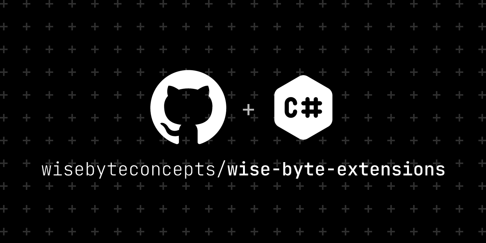

# Wise Byte Extensions

A collection of useful .NET 8 extension methods and utilities to enhance productivity and code readability in your .NET projects.

## Features

- Extension methods for common .NET types (e.g., `string`, `IEnumerable<T>`, `DateTime`, `IValueConverter`, `Controls`, `Styles` etc.)
- Utilities for collections, LINQ, and data manipulation
- Helper methods for working with tasks, async/await, and exceptions
- Designed for .NET 8 and compatible with modern C# features
- Well-documented and easy to use
- Open source and community-driven
- Lightweight and performant
- Extensible and customizable
- Easy to integrate into existing projects

## Getting Started

### Prerequisites

- [.NET 8 SDK](https://dotnet.microsoft.com/download/dotnet/8.0)
- [WinUI3](https://learn.microsoft.com/en-us/windows/apps/winui/winui3/create-your-first-winui3-app)

### Installation

Add a reference to the project or package in your `.csproj` file:

### Usage

Import the namespace in your C# files:

## Contributing

Contributions are welcome! Please open issues or submit pull requests for new features, bug fixes, or improvements.

1. Fork the repository
2. Create a new branch (`git checkout -b feature/your-feature`)
3. Commit your changes
4. Push to the branch (`git push origin feature/your-feature`)
5. Open a pull request

## License

This project is licensed under the MIT License. See the [LICENSE](LICENSE) file for details.

## Contact

For questions or suggestions, please open an issue in the repository.
